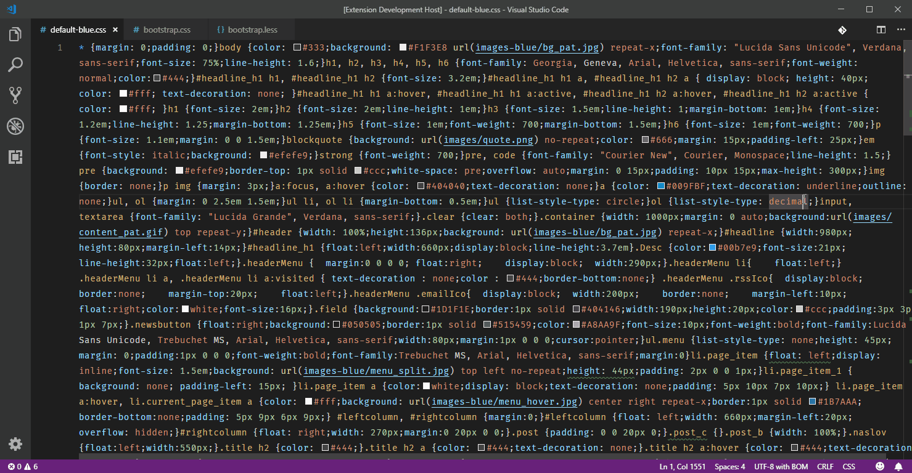

# Formate: CSS, LESS and SCSS Formatter
VSCode plugin to format your CSS / LESS and SCSS files which can **vertical align** properties. See image for an demo.

## Installation
Install through VS Code extensions. Search for formate.

## Usage
On Windows:
1. CTRL + Shift + P -> Format Document
2. CTRL + ALT + F

On Mac:
1. CMD + Shift + P -> Format Document
2. CMD + ALT + F

## Extension Settings
| Tables                            | Description                                         | Type    | Default  |
|:--------------------------------- |:----------------------------------------------------|:-------:|:--------:|
| formate.enable                    | Enables/disables the extension                      | boolean | true     |
| formate.verticalAlignProperties   | Controls if properties should be aligned vertically | boolean | true     |
| formate.additionalSpaces          | if vertical alignment is on, this setting is to add extra spaces | boolean | 0     |

## Release Notes
This is my first extension I hope you like it.

### 1.0.0

Initial release of CSS, LESS and SCSS Formatter
